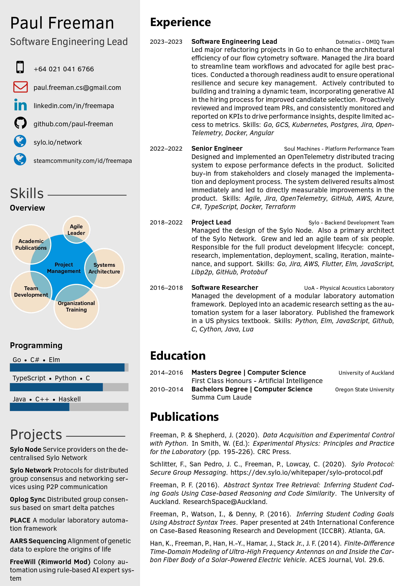

# About my CV

This repository contains my CV and was created from a template that has been
passed around the Internet for some time, it seems. I have made a few
modification, but most of the credit should go to the previous developers. I
have included credit to the author, Harshavardhan Gadgil, as their version was
the base of my current CV.

The license on this CV is the Apache License, Version 2.0, so feel free to use
my code as a starting point for your own CV.

## Installation (VSCode Dev Container *preferred*)

1. Open in VSCode

2. Launch in dev container

3. Run `make`

## Installation (Docker)

1. Install Docker

2. Run `make`

## Installation (Ubuntu - TexLive 2019)

1. Install TeX Live 2019.

2. Compile the CV with lualatex.

## Installation (Ubuntu - TexLive 2018 *(possibly outdated)*)

1. Install TeX Live 2018.

2. I then needed to [rebuild my font cache to include the TeX Live fonts](https://tex.stackexchange.com/questions/257231/using-the-tex-live-fonts-in-xelatex?utm_medium=organic&utm_source=google_rich_qa&utm_campaign=google_rich_qa).

3. Compile the CV with xelatex.

If one of these doesn't work, you're basically on your own. It took me a bit of
time to figure it out myself. Good luck!

## License

```
Copyright 2023 Paul Freeman
Copyright 2016 Harshavardhan Gadgil

Licensed under the Apache License, Version 2.0 (the "License");
you may not use this file except in compliance with the License.
You may obtain a copy of the License at

   http://www.apache.org/licenses/LICENSE-2.0

Unless required by applicable law or agreed to in writing, software
distributed under the License is distributed on an "AS IS" BASIS,
WITHOUT WARRANTIES OR CONDITIONS OF ANY KIND, either express or implied.
See the License for the specific language governing permissions and
limitations under the License.
```
